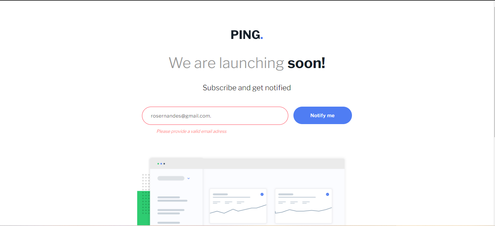

# Frontend Mentor - Ping coming soon page solution

This is a solution to the [Ping coming soon page challenge on Frontend Mentor](https://www.frontendmentor.io/challenges/ping-single-column-coming-soon-page-5cadd051fec04111f7b848da). Frontend Mentor challenges help you improve your coding skills by building realistic projects. 

## Table of contents

- [Overview](#overview)
  - [The challenge](#the-challenge)
  - [Screenshot](#screenshot)
  - [Links](#links)
- [My process](#my-process)
  - [Built with](#built-with)
  - [What I learned](#what-i-learned)
  - [Continued development](#continued-development)
  - [Useful resources](#useful-resources)
- [Author](#author)

## Overview

### The challenge

Users should be able to:

- View the optimal layout for the site depending on their device's screen size
- See hover states for all interactive elements on the page
- Submit their email address using an `input` field
- Receive an error message when the `form` is submitted if:
	- The `input` field is empty. The message for this error should say *"Whoops! It looks like you forgot to add your email"*
	- The email address is not formatted correctly (i.e. a correct email address should have this structure: `name@host.tld`). The message for this error should say *"Please provide a valid email address"*

### Screenshot



### Links

- Solution URL: [GitHub](https://github.com/Jao16905/Ping-landing-page.git)
- Live Site URL: [Vercel](https://your-live-site-url.com)

## My process

### Built with

- Semantic HTML5 markup
- Flexbox
- Javascript

### What I learned

I learned how to use string porperties and methods like `search()` and `indexOf()`. I also learned how to interrupt a form submit.

Best part of my code:
 ```js
 if(
    (email != "") &&
    (usuario.length >=1) &&
    (dominio.length >=3) &&
    (usuario.search("@")==-1) &&
    (dominio.search("@")==-1) &&
    (usuario.search(" ")==-1) &&
    (dominio.search(" ")==-1) &&
    (dominio.search(".")!=-1) &&
    (dominio.indexOf(".") >=1)&&
    (dominio.lastIndexOf(".") < dominio.length - 1)
 )
 ```

### Continued development

I wanna learn more about validation using JS, since it's very useful in projects like landing pages or other type of pages that use emails.

### Useful resources

- [Developer Mozilla - CSS Selectors](https://developer.mozilla.org/pt-BR/docs/Web/CSS/CSS_Selectors) - This helped me to know what selectors i could use in this project.
- [W3 Schools - Style Object](https://www.w3schools.com/jsref/dom_obj_style.asp) - This is an amazing list that helped me to know the right DOM object to use in the style object.
- [Developer Mozilla - Border](https://developer.mozilla.org/en-US/docs/Web/CSS/margin) - This helped me to use correctly the margin propertie

## Author

- Frontend Mentor - [@Jao16905](https://www.frontendmentor.io/profile/Jao16905)
